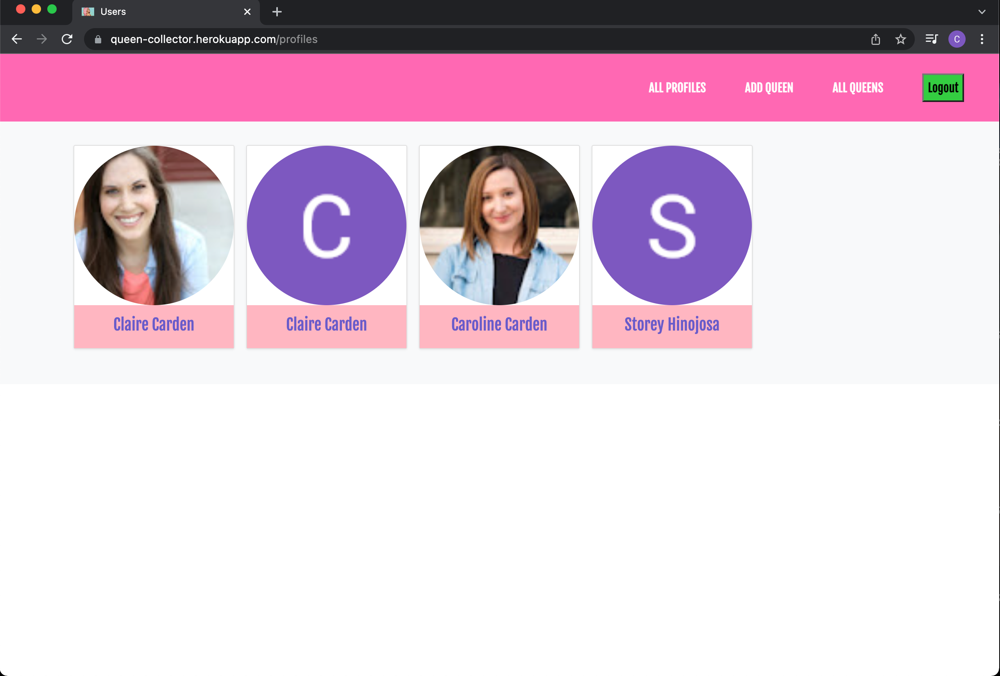

# The Queen-Collector

## About:
  - The Queen Collector is an app for fans of Rupaul's Drag Race to come together to add and favorite their favorite queens. 
  - Users can add a queen, edit the info on queens they have added, add "Reads", or comments for each queen, and view queens all users have 'favorited' on individual profile pages.

## Getting Started:
- Launch the app here -
  <a href="https://queen-collector.herokuapp.com">Queen Collector</a>
- Here is a link to my planning materials - 
  <a href="https://trello.com/b/CI9ehJaH/drag-queen-collector">Trello</a>
- After the launching the app, sign in with your google email address.
- Click on 'Add A Queen" to add a queen to the list.
- Click on 'All Queens' to view the full list of queens. 
- Clicking on 'Details' will take you to the selected queens info page. Here you can add the queen to your favorites, as well as add 'reads'.
- If you have added the queen you click on, Details is also where you can Edit the info.
- The X Button will delete the queen you have added.
- 'Profiles' will take you to all the profiles. You can click on a profile to see queens that user has favorited.
- Enjoy!

## What the Game Looks Like:

## Technologies used:
- HTML
- EJS
- CSS
- Javascript
- Node.js
- Express
- MongoDB
- Mongoose
- Bootstrap

## Next Steps:
- A place for users to add in photos of the queens
- A page where users can sort the queens by seasons.
- Light/Dark Mode

## Credits:
- Favicon: [RuPaul](https://images.app.goo.gl/xruNuLnjJWt5527P6)